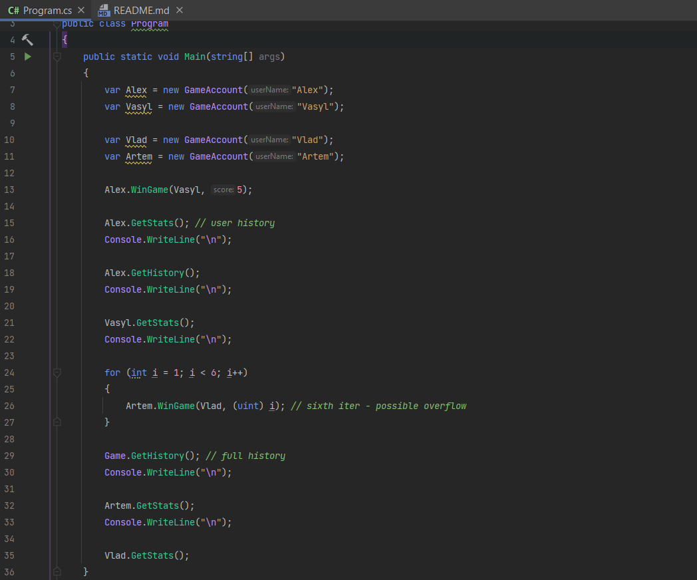
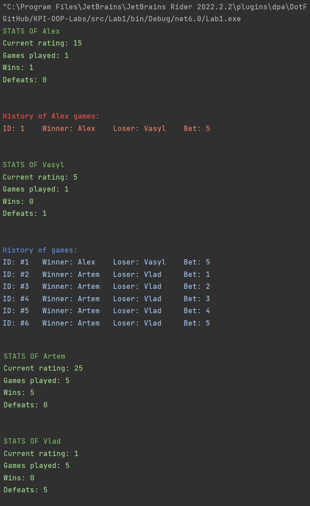

<h1>Лабораторна робота №1</h1>
<h3>Тема: Класи та об'єкти</h3>
<h3>Оцінка: 10/10</h3>
<h3>Завдання:</h3>
  Створити клас GameAccount.<br>
  Клас має обов’язково мати поля:
  <ul>
    <li>UserName – Імя користувача</li>
    <li>CurrentRating – Рейтинг користувача</li>
    <li>GamesCount – Кількість зіграних партій</li>
  </ul>
Клас має мати функції:
  <ul>
    <li>WinGame з полями – функція яка визивається у випадку перемоги
      <ul>
        <li>opponent – акаунт оппонента</li>
        <li>Rating – рейтинг на який була гра</li>
      </ul>
  </li>
        <li>LoseGame з полями – функція яка визивається у випадку поразки
      <ul>
        <li>opponent – акаунт оппонента</li>
        <li>Rating – рейтинг на який була гра</li>
      </ul>
  </li>
    <li>GetStats – функція яка показує історію ігор(Проти кого, перемога чи поразка, на який рейтинг грали, індекс гри)</li>
  </ul>
Додаткові умови:
  <ul>
    <li>Рейтинг не може стати менше 1. </li>
    <li>Рейтинг на який грають не може бути від'ємним(в цьому випадку треба викинути помилку).</li>
    <li>Для гри треба створити окремий клас в йому буде зберігатися потрібна інформація. </li>
    <li>В мейні треба створити 2 об’єкти класу гравця, зробити імітацію декількох ігр та вивести статистику кожного гравця.</li>
  </ul>

<h3>Опис роботи:</h3>
У програмі реалізовано 3 класи: Game.cs, GameAccount.cs, та Program.cs.

<h3>Коротка документація</h3>
<ul>
    <li><a href="#Game">Game.cs</a></li>
    <li><a href="#GameAccount">GameAccount.cs</a></li>
    <li><a href="#Program">Program.cs та результати роботи</a></li>
</ul>

<h4 id="Game">Game.cs</h4>
Цей клас є типом даних "Гра". 
Має такі поля та властивості:

```csharp
private static uint _idCounter = 1;
internal static List<Game> Games;
public GameAccount Winner { get; }
public GameAccount Loser { get; }
public uint Score { get; }
public uint GameId { get; }
```
API:

```csharp
public Game(GameAccount winner, GameAccount loser, uint score)
public static void GetHistory()
```
<h4 id="GameAccount">GameAccount.cs</h4>

Даний клас є типом даних "Акаунт".
Має такі поля та властивості: 

```csharp
public string UserName { get; }
public uint CurrentRating { get; }
private List<Game> gameList;
```
API:

``` csharp
public GameAccount(string userName)
public void WinGame(GameAccount opponent, uint score)
public void LoseGame(GameAccount opponent, uint score)
public void GetStats()
public void GetHistory()
```
<h4 id="Program">Program.cs та результати роботи</h4>

В ```Program.cs``` відбувається запуск програми та симуляція гри.



<b>Приклад результату:</b>


