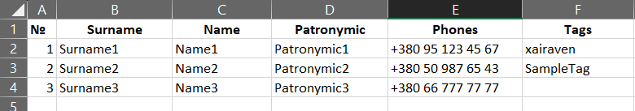

<h1 align="center">Практичне завдання №1</h1>

**Імпорт контактів з Excel в Telegram чат**.  
*DevOps, 5 семестр*

### Призначення проекту
Скрипт потрібен для імпорту контактів з Excel файлу до певного чату (мегагрупа або канал).

**Приклад таблиці:**

### Як користуватись скриптом?
1. Встановити залежності з `src/requirements.txt`
2. Налаштувати `src/settings.json`:

    - Поля `api_id` та `api_hash` треба отримати з [my.telegram.org](https://my.telegram.org/apps);
    - Chat `id` можна отримати будь-яким довільним способом. Наприклад, за допомогою [@getidsbot](https://t.me/getidsbot);
    - `start-reading-from-row`: з якого рядку починати читати таблицю;
    - `rows`: тут можна встановити текстовий відповідник кожному стовбчику. Обов'язковим є лише `phone`, опціональним - `tag`.
3. Запустити скрипт в консолі, аргументом передати шлях до заповненої таблиці.

---

Якщо є питання, пишіть в Телеграм - [@xairaven](t.me/xairaven) 