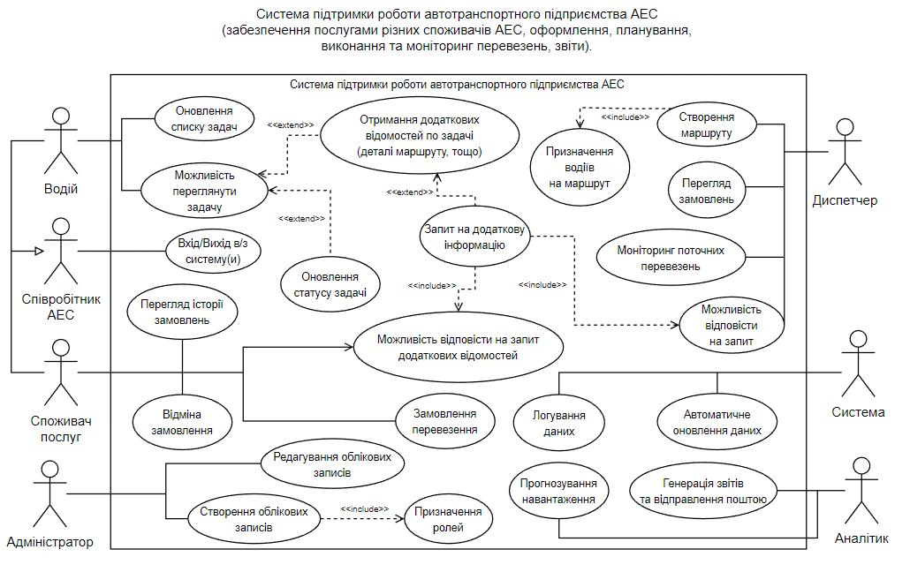

# Лабораторна робота №1

- Варіант: 22 *(5)*
- Функціональні вимоги: [*Draw.io Diagram*](./FunctionalRequirements.drawio)
- Нефункціональні вимоги: [*Markdown File*](./NonFunctionalRequirements.md)
- Оцінка: 5/5

### Завдання:
    До свого варіанту розробіть первинні вимоги до програмного забезпечення:
        - Функціональні, у вигляді UML діаграми Use-Case;
        - Нефункціональні, за розділами вимог до реалізації, надійності, продуктивності, безпеки тощо.

### Use-Case діаграма, функціональні вимоги:

### Предметна область:
**Система підтримки роботи автотранспортного підприємства АЕС**.  
Забезпечення послугами різних споживачів АЕС, оформлення, планування, виконання та моніторинг перевезень, генерація звітів.