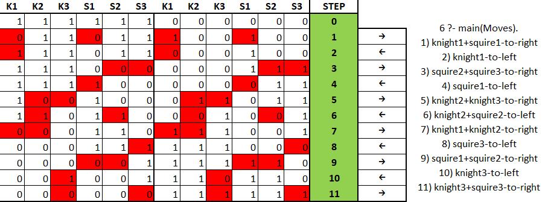
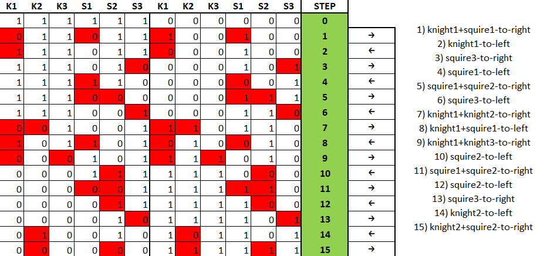

### Lab 10

**Assignment Number**: 19

Three knights, each accompanied by a squire, gathered on the bank of the river, 
intending to cross to the other side. They managed to find a small two-seater boat, 
and the crossing would be easy. But all the squires flatly refused to remain in the 
society of unfamiliar knights without their masters. And yet the crossing took place, 
all six people crossed to the other shore with the help of one two-seater boat. 
At the same time, the condition insisted on by the squires was observed. How was it done?

**Results example:**
```prolog
6 ?- main(Moves).
1) knight1+squire1-to-right
2) knight1-to-left
3) squire2+squire3-to-right
4) squire1-to-left
5) knight2+knight3-to-right
6) knight2+squire2-to-left
7) knight1+knight2-to-right
8) squire3-to-left
9) squire1+squire2-to-right
10) knight3-to-left
11) knight3+squire3-to-right
```



---

```prolog
1) knight1+squire1-to-right
2) knight1-to-left
3) squire3-to-right
4) squire1-to-left
5) squire1+squire2-to-right
6) squire3-to-left
7) knight1+knight2-to-right
8) knight1+squire1-to-left
9) knight1+knight3-to-right
10) squire2-to-left
11) squire1+squire2-to-right
12) squire2-to-left
13) squire3-to-right
14) knight2-to-left
15) knight2+squire2-to-right
```

