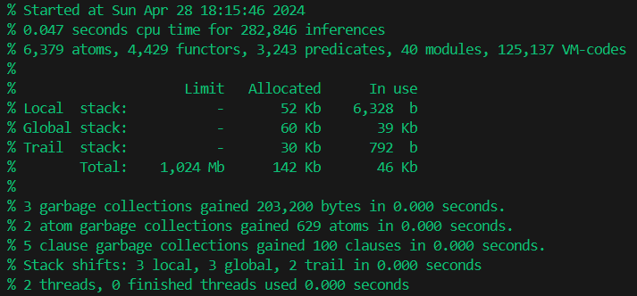
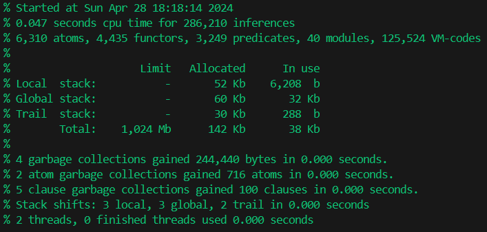

### Lab 11

**Assignment Number**: 19

Three knights, each accompanied by a squire, gathered on the bank of the river, 
intending to cross to the other side. They managed to find a small two-seater boat, 
and the crossing would be easy. But all the squires flatly refused to remain in the 
society of unfamiliar knights without their masters. And yet the crossing took place, 
all six people crossed to the other shore with the help of one two-seater boat. 
At the same time, the condition insisted on by the squires was observed. How was it done?

---
**Heuristic Formula**:

DistanceToGoal is K1 + K2 + K3 + S1 + S2 + S3,
Progress is 6 - DistanceToGoal.

Not ideal, but example from lecture anyway opens all states - not in legal predicate, but by formula.

---

**Results example:**

*DFS:*
```prolog
2 ?- main(Moves).
1) knight1+squire1-to-right
2) knight1-to-left
3) squire2+squire3-to-right
4) squire1-to-left
5) knight2+knight3-to-right
6) knight2+squire2-to-left
7) knight1+knight2-to-right
8) squire3-to-left
9) squire1+squire2-to-right
10) knight3-to-left
11) knight3+squire3-to-right
```

States:

```prolog
Moves = [knight1+squire1-to-right, knight1-to-left, squire2+squire3-to-right, squire1-to-left, knight2+knight3-to-right, knight2+squire2-to-left, ... + ... - to-right, ... - ... - left, ... - ...|...],
OpenedStates = [state([right, right, right], [right, right, right]), state([right, right, left], [right, right, left]), state([right, right, right], [right, right, left]), state([right, right, right], [left, left, left]), state([right, right, right], [left, left, right]), state([left, left|...], [right, left|...]), state([right|...], [right|...]), state([...|...], [...|...]), state(..., ...)|...],

AmountOpenedStates = 27
```

Statistics:



---

*Hill-Climbing:*

```prolog
2 ?- main(Moves).
1) knight-1+squire-1-to-right
2) knight-1-to-left
3) squire-2+squire-3-to-right
4) squire-1-to-left
5) knight-2+knight-3-to-right
6) knight-2+squire-2-to-left
7) knight-1+knight-2-to-right
8) squire-3-to-left
9) squire-1+squire-2-to-right
10) knight-3-to-left
11) knight-3+squire-3-to-right
```

States:

```prolog
Moves = [knight-1+squire-1-to-right, knight-1-to-left, squire-2+squire-3-to-right, squire-1-to-left, ... - ... + knight-3-to-right, ... + ... - 2-to-left, ... - ... 
- to-right, ... - ... - left, ... - ...|...],
OpenedStates = [state([right, right, right], [right, right, right]), state([right, right, left], [right, right, left]), state([right, right, right], [right, right, left]), state([right, right, right], [left, left, left]), state([right, right, right], [left, left, right]), state([left, left|...], [left, left|...]), state([left|...], [left|...]), state([...|...], [...|...]), state(..., ...)|...],

AmountOpenedStates = 11
```

Statistics:

