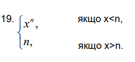

# Лабораторна робота №3

- Варіант: 19
- Скрипти: [*Каталог ./src*](./src/)
- Оцінка: 6/6

### Завдання
Представити на Пролозі функцію f(x), задану в індивідуальному завданні:



### Запити

Приклад 1:
```prolog
2 ?- func(10, 5, Result).
Result = 5.
```

Приклад 2:
```prolog
3 ?- func(5, 10, Result). 
Result = 9765625 .
```

Приклад 3:
```prolog
4 ?- func(-3, -1, Result). 
Result = -0.3333333333333333 .
```