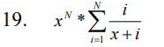
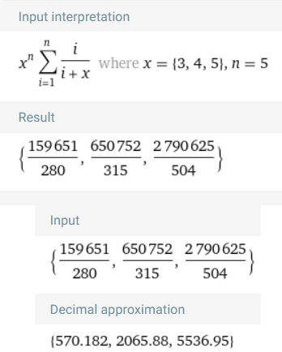
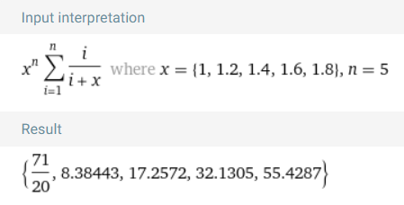

# Лабораторна робота №4

- Варіант: 19
- Скрипт: [*Файл Prolog (.pl)*](./src/function.pl)
- Оцінка: 6/6

### Завдання
Отримати список значень заданої в індивідуальному завданні функції. 
Інтервал значень змінної х, крок в інтервалі і додаткові параметри задаються в запиті.



### Запити

```prolog
8 ?- function(3, 5, 1, 1, 5, List). 
List = [570.1821428571429, 2065.879365079365, 5536.954365079365] .
```



---

```prolog
9 ?- function(1, 4, 0.2, 1, 5, List). 
List = [3.5500000000000003, 8.384427959137636, 17.25721722123192, 32.13053211522776, 55.42873768091625, 90.0571428571428, 139.41704689038554, 207.41794132100011, 298.48749407775045|...] .
```

