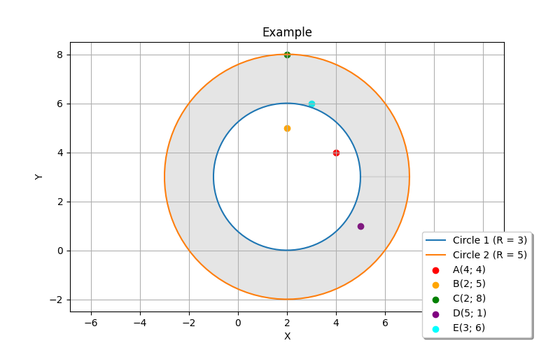

# Лабораторна робота №8

- Варіант: 19
- Скрипт: [*Файли Prolog (.pl)*](./src/)
- Оцінка: 6/6

### Завдання
Дано центр і радіуси двох коцентричних кіл.

Знайдіть усі точки, які належать бублику сформованому з цих кіл.

Використати assert-retract та records механізми.



### Запити

Механізм assert-retract:
```prolog
2 ?- task(2, 3, 3, 5, List).
List = [c, d, e].

3 ?- retract(point(e, 3, 6)).
true.

4 ?- task(2, 3, 3, 5, List).
List = [c, d].

5 ?- assert(point(j, 0, 0)).
true.

6 ?- task(2, 3, 3, 5, List). 
List = [c, d, j].
```


Механізм records:
```prolog
2 ?- task(2, 3, 3, 5, List).
List = [c, d, e].

3 ?- recorded(db, X).
X = point(a, 4, 4) ;
X = point(b, 2, 5) ;
X = point(c, 2, 8) ;
X = point(d, 5, 1) ;
X = point(e, 3, 6).

4 ?- recorded(db, X, Reference). 
X = point(a, 4, 4),
Reference = <record>(000001f947c7ab70) ;
X = point(b, 2, 5),
Reference = <record>(000001f947c7b3e0) ;
X = point(c, 2, 8),
Reference = <record>(000001f947c7abd0) ;
X = point(d, 5, 1),
Reference = <record>(000001f947c7aea0) ;
X = point(e, 3, 6),
Reference = <record>(000001f947c7ad20).

5 ?- recorded(db, point(e, 3, 6)).
true.

6 ?- recorded(db, X, Reference), erase(Reference).
X = point(a, 4, 4),
Reference = <record>(000001f947c7ab70) ;
X = point(b, 2, 5),
Reference = <record>(000001f947c7b3e0) ;
X = point(c, 2, 8),
Reference = <record>(000001f947c7abd0) ;
X = point(d, 5, 1),
Reference = <record>(000001f947c7aea0) ;
X = point(e, 3, 6),
Reference = <record>(000001f947c7ad20).

7 ?- recorded(db, point(e, 3, 6)).
false.
```