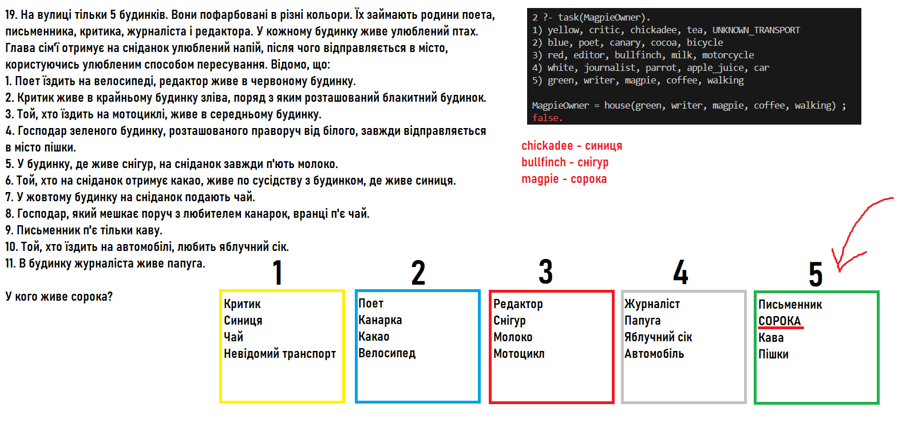

# Лабораторна робота №9

- Варіант: 19
- Скрипт: [*Файл Prolog (.pl)*](./src/task.pl)
- Оцінка: 10/10

### Завдання
На вулиці тільки 5 будинків. Вони пофарбовані в різні кольори. Їх займають
родини поета, письменника, критика, журналіста і редактора. У кожному
будинку живе улюблений птах. Глава сім'ї отримує на сніданок улюблений
напій, після чого відправляється в місто, користуючись улюбленим
способом пересування. Відомо, що:
1. Поет їздить на велосипеді, редактор живе в червоному будинку.
2. Критик живе в крайньому будинку зліва, поряд з яким розташований
блакитний будинок.
3. Той, хто їздить на мотоциклі, живе в середньому будинку.
4. Господар зеленого будинку, розташованого праворуч від білого, завжди
відправляється в місто пішки.
5. У будинку, де живе снігур, на сніданок завжди п'ють молоко.
6. Той, хто на сніданок отримує какао, живе по сусідству з будинком, де
живе синиця.
7. У жовтому будинку на сніданок подають чай.
8. Господар, який мешкає поруч з любителем канарок, вранці п'є чай.
9. Письменник п'є тільки каву.
10. Той, хто їздить на автомобілі, любить яблучний сік.
11. В будинку журналіста живе папуга.

У кого живе сорока?



### Запити

Приклад:
```prolog
2 ?- task(MagpieOwner).
1) yellow, critic, chickadee, tea, UNKNOWN_TRANSPORT
2) blue, poet, canary, cocoa, bicycle
3) red, editor, bullfinch, milk, motorcycle
4) white, journalist, parrot, apple_juice, car
5) green, writer, magpie, coffee, walking

MagpieOwner = house(green, writer, magpie, coffee, walking) ;
false.
```