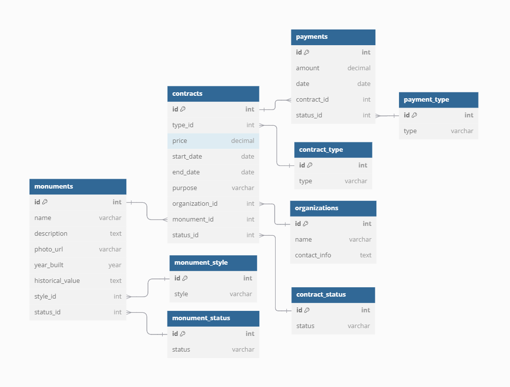

# Лабораторна робота №3

- Тема: *Розробка структури бази даних і контрольного прикладу для АРМ ІС*
- Варіант: 18
- Звіт: [*Link*](./Report.pdf)
- Оцінка: 10/10

### Завдання:
    Розробити звіт, що містить структуру бази даних та контрольний 
    приклад для АРМ ІС. 
    Повинні бути визначені: 
    - склад таблиць: з кожної таблиці – поля, розмірність полів, тип полів; 
    - взаємозв’язок таблиць: ключові атрибути; 
    - структура: намалювати структуру бази даних. 
    Контрольний приклад повинен забезпечити перевірку функціонування АРМ ІС, 
    у тому числі дій, що виконуються користувачами в процесі експлуатації, та реакції АРМ 
    на дії користувачів.

### Предметна область:
**ІС обліку історичних пам’яток м. Житомир**.  
Зразковий зміст бази даних: 
- код об’єкта, найменування, фотографії; 
- історичні  характеристики  об’єкта  (стародавність  та  ін.),  текстова характеристика об’єкта; 
- поточний стан об’єкта, для чого використовується в даний час, вартість об’єкта, якщо об’єкт в експлуатації –  ким (інформація про експлуатуючу організацію або приватну особу); 
- інше.

