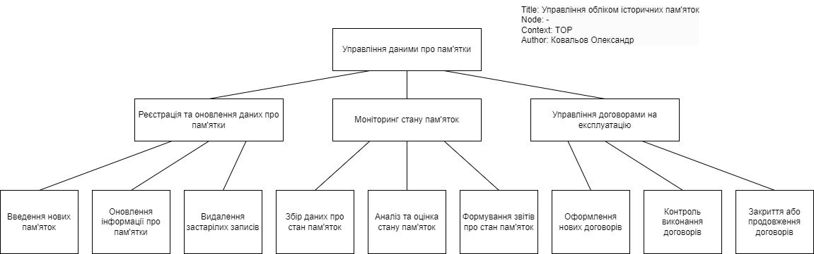

# Лабораторна робота №4

- Тема: *Побудова моделі інформаційної системи за методологією IDEF0*
- Варіант: 18
- Звіт: [*Link*](./Report.pdf)
- Оцінка: 10/10

### Завдання:
    Розробити контекстну модель інформаційної системи відповідно варіанту
    предметної області з перших трьох лабораторних робіт. Використати для цього 
    СASE cистему Bpwin. Розробити моделі декомпозиції інформаційної системи до 
    третього рівня ієрархії за допомогою вищезгаданої CASE системи. Розробити дерево 
    вузлів моделей декомпозиції.

### Предметна область:
**ІС обліку історичних пам’яток м. Житомир**.  
Зразковий зміст бази даних: 
- код об’єкта, найменування, фотографії; 
- історичні  характеристики  об’єкта  (стародавність  та  ін.),  текстова характеристика об’єкта; 
- поточний стан об’єкта, для чого використовується в даний час, вартість об’єкта, якщо об’єкт в експлуатації –  ким (інформація про експлуатуючу організацію або приватну особу); 
- інше.

