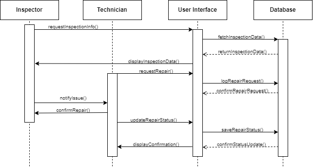

# Лабораторна робота №5

- Тема: *Проектування UML-діаграм для ІС засобами CASE систем*
- Варіант: 18
- Звіт: [*Link*](./Report.pdf)
- Оцінка: 10/10

### Завдання:
    Розробити діаграму прецедентів інформаційної системи відповідно 
    варіанту предметної області. Використати для цього СASE cистему 
    Rational Rose або іншу. Розробити діаграму класів 
    (4-6 об’єктів інформаційної системи). Згенерувати в Rational Rose 
    код програмної системи в Java або С++ опису класів. Розробити діаграму 
    кооперації (взаємодії). Розробити діаграму послідовності.

### Предметна область:
**ІС обліку історичних пам’яток м. Житомир**.  
Зразковий зміст бази даних: 
- код об’єкта, найменування, фотографії; 
- історичні  характеристики  об’єкта  (стародавність  та  ін.),  текстова характеристика об’єкта; 
- поточний стан об’єкта, для чого використовується в даний час, вартість об’єкта, якщо об’єкт в експлуатації – ким (інформація про експлуатуючу організацію або приватну особу); 
- інше.

