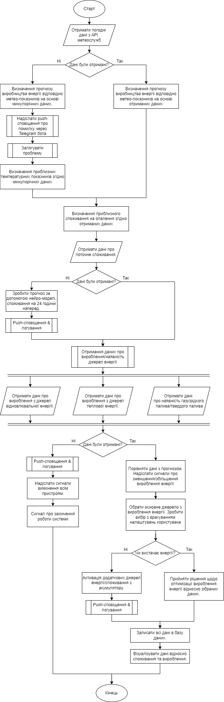

# Лабораторна робота №1

- Тема: *Розробка програмного забезпечення для ефективного використання енергетичних ресурсів житлової будівлі*
- Варіант: *18*
- Завдання: [*Task.pdf*](./Task.pdf)
- Звіт: [*Report.pdf*](./Report.pdf)
- Оцінка: *10/10*

