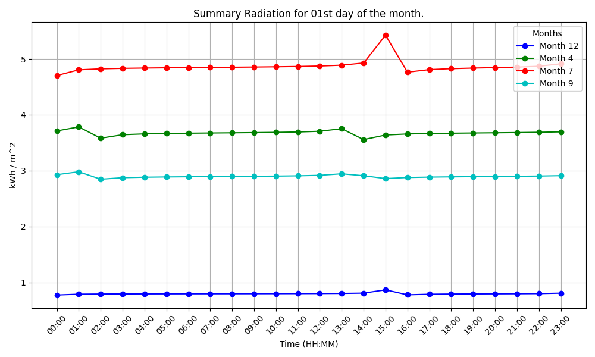
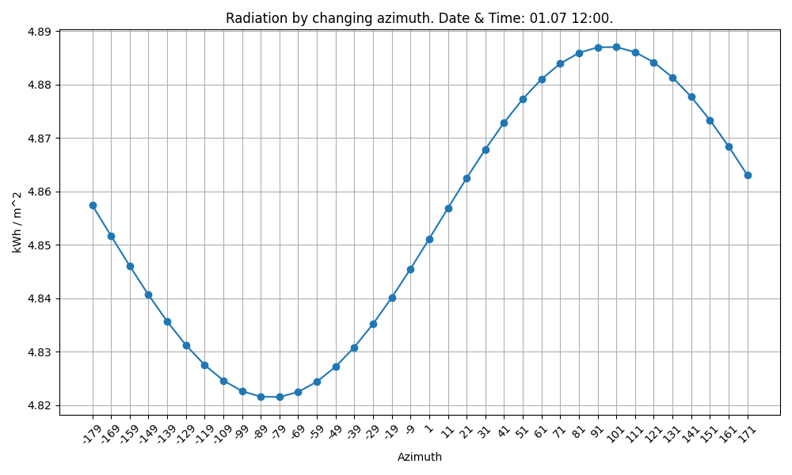

# Лабораторна робота №2

- Тема: *Розробка імітаційної моделі діючої сонячної електростанції*
- Варіант: *18*
- Завдання: [*Task.pdf*](./Task.pdf)
- Звіт: [*Report.pdf*](./Report.pdf)
- Код для генерації графіків: [*Python scripts*](./python/)
- Код системи: [*Rust binary crate*](./rust/)
- Оцінка: *10/10*

